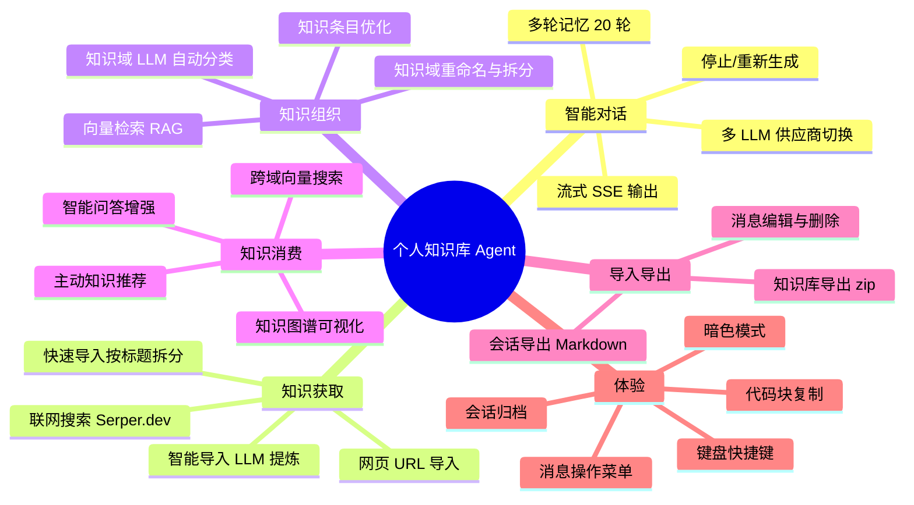
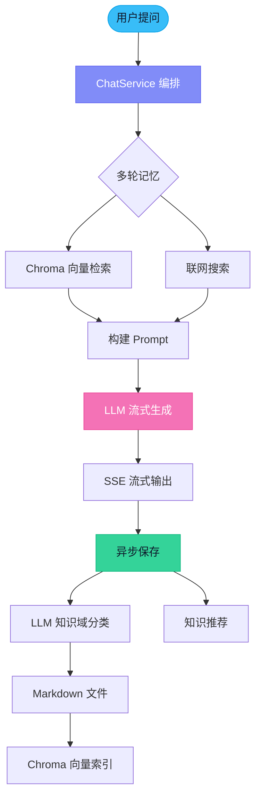

# 个人知识库 Agent

一个智能问答系统，支持联网搜索，将对话内容自动整理为结构化 Markdown 知识库，支持增量更新和多轮对话。

## 功能概览



### 核心功能架构



### 功能矩阵

| 优先级 | 功能 | 状态 | 说明 |
|--------|------|------|------|
| **P0** | 流式对话 (SSE) | ✅ | SSE 流式输出，渐进式 Markdown 渲染 |
| **P0** | 多轮记忆 | ✅ | MessageChatMemoryAdvisor，按会话隔离，窗口 20 轮 |
| **P0** | 知识库 RAG 检索 | ✅ | Chroma 向量相似度检索，topK=3，阈值 0.6 |
| **P0** | 联网搜索 | ✅ | Serper.dev Google Search API，可开关 |
| **P0** | 多 LLM 供应商 | ✅ | LongCat（默认）+ DeepSeek，可手动切换 |
| **P0** | 知识域自动分类 | ✅ | LLM 智能分类到知识域或创建新域 |
| **P0** | 流式 Markdown 渲染 | ✅ | 自动修复未闭合标记，渐进式渲染 |
| **P1** | 停止/重新生成 | ✅ | AbortController 中断，WebFlux 自动取消 |
| **P1** | 知识库搜索 | ✅ | 向量检索跨域搜索，结果带预览 |
| **P1** | 知识条目管理 | ✅ | 查看/编辑/删除单条 Q&A，内联编辑 |
| **P2** | 会话导出 | ✅ | 前端导出会话为 Markdown 文件 |
| **P2** | 知识库导入/导出 | ✅ | 导出 zip / 快速导入 / 智能导入（LLM 提炼） |
| **P2** | 消息编辑与删除 | ✅ | 修改用户消息，后续 AI 回复联动更新 |
| **P3** | 键盘快捷键 | ✅ | Ctrl+N 新对话、Ctrl+K 聚焦搜索、Esc 停止 |
| **P3** | 暗色模式 | ✅ | CSS 变量 + 系统偏好检测 + localStorage |
| **P3** | 代码块复制 | ✅ | 代码块头部复制按钮，点击变"✓ 已复制" |
| **P3** | 知识图谱 | ✅ | LLM 提取概念 + @xyflow/react 交互式可视化 |
| **P4** | 知识域重命名 | ✅ | 同步更新 Markdown 文件和向量索引 |
| **P4** | 知识域整理与拆分 | ✅ | LLM 分析域内容，将混杂域拆分为多个精确域 |
| **P4** | 知识条目优化 | ✅ | LLM 优化单条 Q&A，保留 Markdown 格式 |
| **P4** | 网页 URL 导入 | ✅ | 输入 URL 抓取内容，LLM 提炼 Q&A 并分类 |
| **智能** | 主动知识推荐 | ✅ | 问答结束后自动推荐相关知识条目 |
| **智能** | 智能问答增强 | ✅ | LLM 融合多条知识形成结构化回答 |
| **智能** | 会话归档 | ✅ | 活跃/归档分离，防止 sessions.json 无限增长 |
| **Phase 2** | 知识自动维护 | 🔴 | 合并重复、检测矛盾、标记过时 |
| **Phase 2** | 知识健康报告 | 🟡 | 域统计、重复率、活跃度、缺口分析 |
| **Phase 2** | 多源导入扩展 | 🟢 | 浏览器书签导入、剪贴板监控 |

> 📊 **29 项已完成 · 3 项规划中** | 完整规划见 [docs/ROADMAP.md](docs/ROADMAP.md)

---

## 技术栈

| 层 | 技术 |
|---|------|
| 前端 | React 18 + Vite + Zustand |
| 后端 | Java 21 + Spring Boot 4.1 + Spring AI 2.0.0 |
| 对话模型 | DeepSeek Chat (默认) / LongCat (美团, 可切换) |
| 向量嵌入 | Ollama (nomic-embed-text, 本地运行) |
| 向量数据库 | Chroma DB |
| 联网搜索 | Serper.dev (Google Search API, 免费 2500 次/月) |

## 架构

```
┌─────────────────────────────────────────────────────────┐
│                    Frontend (React 18)                    │
│  Chat UI │ Knowledge Browser │ Session Manager           │
└──────────────────────┬──────────────────────────────────┘
                       │ HTTP/SSE (streaming)
┌──────────────────────┴──────────────────────────────────┐
│                Backend (Java 21 + Spring Boot 4.1)        │
│                                                          │
│  ChatController → ChatService                           │
│     ├── WebSearchService   (Serper.dev Google Search)    │
│     ├── ChatClient         (DeepSeek via Spring AI)     │
│     ├── KnowledgeService   (Markdown + Chroma)          │
│     └── SessionService     (会话上下文)                  │
│                                                          │
│  Chroma DB ←→ Ollama Embedding (向量检索)                │
│  Local Filesystem ←→ Markdown 知识文件                   │
└──────────────────────────────────────────────────────────┘
```

## 数据流

```
用户提问 → Chroma 检索历史知识 → [可选] 联网搜索
→ DeepSeek 流式生成回答 → 向量分类知识域
→ 追加到 Markdown 文件 → 索引到 Chroma
```

## 项目结构

```
knowledge-agent/
├── docker-compose.yml              # Chroma 容器
├── .env.example                    # 环境变量模板
├── README.md
├── backend/
│   ├── pom.xml
│   └── src/main/
│       ├── resources/application.yml
│       └── java/com/knowledge/
│           ├── KnowledgeAgentApplication.java
│           ├── config/SpringAiConfig.java
│           ├── model/
│           │   ├── ChatMessage.java
│           │   ├── ChatRequest.java
│           │   └── Session.java
│           ├── controller/
│           │   ├── ChatController.java
│           │   └── KnowledgeController.java
│           └── service/
│               ├── ChatService.java          # 核心编排
│               ├── SessionService.java       # 会话管理
│               ├── KnowledgeService.java     # Markdown + Chroma
│               └── WebSearchService.java     # 搜索集成
└── frontend/
    ├── index.html
    ├── vite.config.js
    └── src/
        ├── main.jsx
        ├── App.jsx
        ├── store.js                         # Zustand 状态
        ├── styles/app.css
        └── components/
            ├── Sidebar.jsx                  # 对话/知识域面板
            ├── ChatContainer.jsx            # 主聊天区
            ├── ChatMessages.jsx
            ├── ChatInput.jsx                # 输入 + 联网开关
            └── MarkdownViewer.jsx           # Markdown 渲染
```

## API

| 端点 | 方法 | 说明 |
|------|------|------|
| `/api/chat/stream` | POST | 发送消息，SSE 流式返回（支持 `provider` 参数切换模型） |
| `/api/providers` | GET | 获取可用 LLM 供应商列表 |
| `/api/sessions` | GET | 会话列表 |
| `/api/sessions/{id}` | GET | 会话详情 + 历史消息 |
| `/api/sessions/{id}` | DELETE | 删除会话 |
| `/api/knowledge/domains` | GET | 知识域列表 |
| `/api/knowledge/domains/{name}` | GET | 知识文件内容 |
| `/api/knowledge/domains/{name}` | DELETE | 删除知识域 |

## 快速开始

### 1. 环境准备

- JDK 21+
- Node.js 18+
- Docker (运行 Chroma)
- Ollama (本地向量嵌入)

### 2. 安装 Ollama 并拉取模型

```bash
brew install ollama
ollama serve &
ollama pull nomic-embed-text
```

### 3. 启动 Chroma

```bash
docker-compose up -d
```

### 4. 配置环境变量

```bash
cp .env.example .env
```

编辑 `.env`，必填项：

```bash
DEEPSEEK_API_KEY=sk-your-deepseek-api-key   # DeepSeek API Key
```

联网搜索使用 Serper.dev（Google Search API），需在 `.env` 中配置 `SERPER_API_KEY`。注册获取 Key：https://serper.dev（免费额度 2500 次/月）。

### 5. 启动后端

```bash
cd backend
./mvnw spring-boot:run
```

后端运行在 `http://localhost:8080`

### 6. 启动前端

```bash
cd frontend
npm install
npm run dev
```

前端运行在 `http://localhost:3000`，API 请求自动代理到后端。

## Markdown 知识文件格式

每个知识域对应一个 `.md` 文件，存储在 `data/knowledge/`：

```markdown
# 知识域: 机器学习

## Q: 什么是梯度下降？
**日期**: 2026-06-02 | **来源**: [文章A](url), [文章B](url)

详细回答内容...

---

## Q: 反向传播的原理？
**日期**: 2026-06-02

回答内容...
```

## 核心特性

- **多轮对话**：会话级别上下文记忆，支持历史会话切换
- **多模型切换**：支持 DeepSeek 和 LongCat，可手动切换
- **联网搜索**：一键切换，搜索结果带引用来源
- **自动分类**：通过向量相似度将回答归入对应知识域
- **增量更新**：同一知识域的新内容追加到已有文件
- **流式响应**：SSE 实时显示 LLM 生成内容

## 多模型配置

在 `.env` 中添加 `LONGCAT_API_KEY` 即可启用 LongCat 作为备用模型：

```bash
# .env
DEEPSEEK_API_KEY=sk-your-deepseek-key
LONGCAT_API_KEY=your-longcat-key  # 可选
```

前端输入框下方会自动显示模型选择器（当多个模型可用时）。
